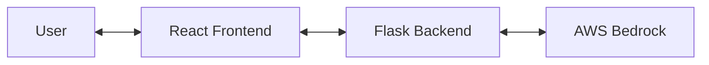

# Architecture Overview

## High-Level Architecture

The PromptToForm project consists of two main components:

- **Frontend**: React + Vite application for user interaction.
- **Backend**: Flask API server that communicates with AWS Bedrock for AI-powered form and workflow generation.

## Directory Structure

- `frontend/` — React app (UI, API calls)
- `backend/` — Flask app (API, AWS integration)
- `backend/form_reference/` — Form schema references-->Sent as reference to the LLM(So that it knows the output format for forms)
- `backend/workflow_reference/` — Workflow schema references-->Sent as reference to the LLM(So that it knows the output format for workflows)

## Data Flow

1. User enters a prompt in the frontend.
2. Frontend sends the prompt to the backend API.
3. Backend processes the prompt, interacts with AWS Bedrock, and generates a form/workflow JSON.
4. Backend returns the generated JSON to the frontend.
5. Frontend displays the result to the user.
