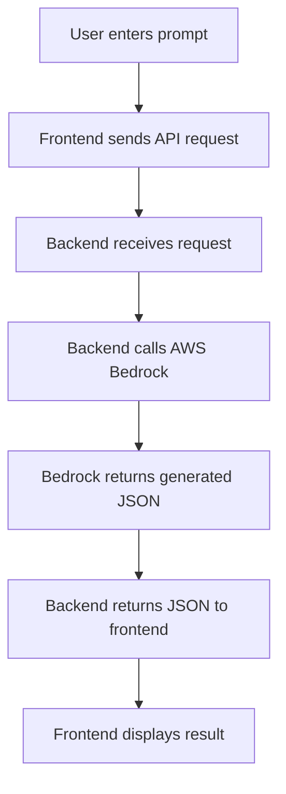

# Flowchart

Below is a flowchart describing the main flow of the PromptToForm application:

```mermaid
flowchart TD
    A[User enters prompt] --> B[Frontend sends API request]
    B --> C[Backend receives request]
    C --> D[Backend calls AWS Bedrock]
    D --> E[Bedrock returns generated JSON]
    E --> F[Backend returns JSON to frontend]
    F --> G[Frontend displays result]
```

_You can render this diagram using a Mermaid plugin or online Mermaid live editor._
