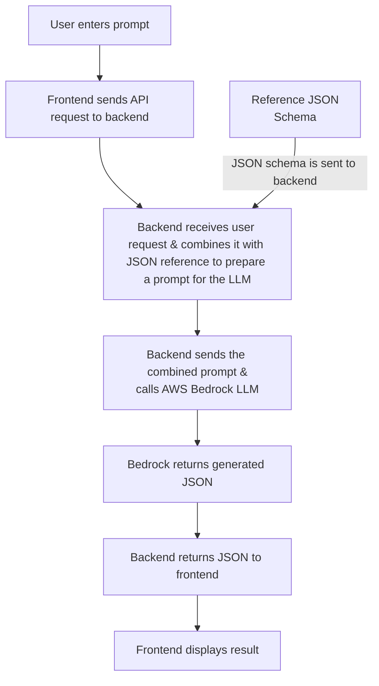

# Flowchart

Below is a flowchart describing the main flow of the PromptToForm application:

```mermaid
flowchart TD
    A[User enters prompt] --> B[Frontend sends API request to backend]
    B --> C[Backend receives user request & combines it with JSON reference to prepare a prompt for the LLM]
    D[Reference JSON<br>Schema] -->|JSON schema is sent to backend| C
    C --> E[Backend sends the combined prompt &<br>calls AWS Bedrock LLM]
    E --> F[Bedrock returns generated JSON]
    F --> G[Backend returns JSON to frontend]
    G --> H[Frontend displays result]
```
