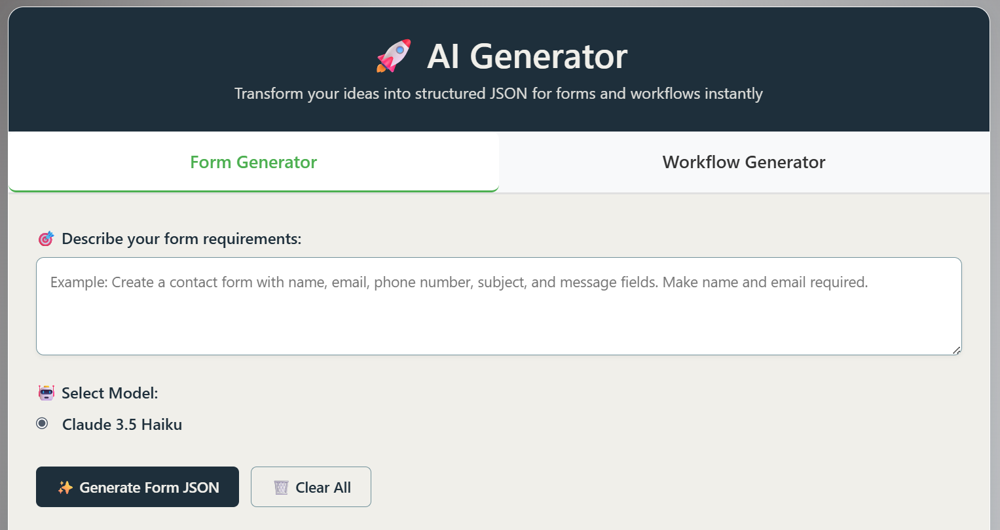
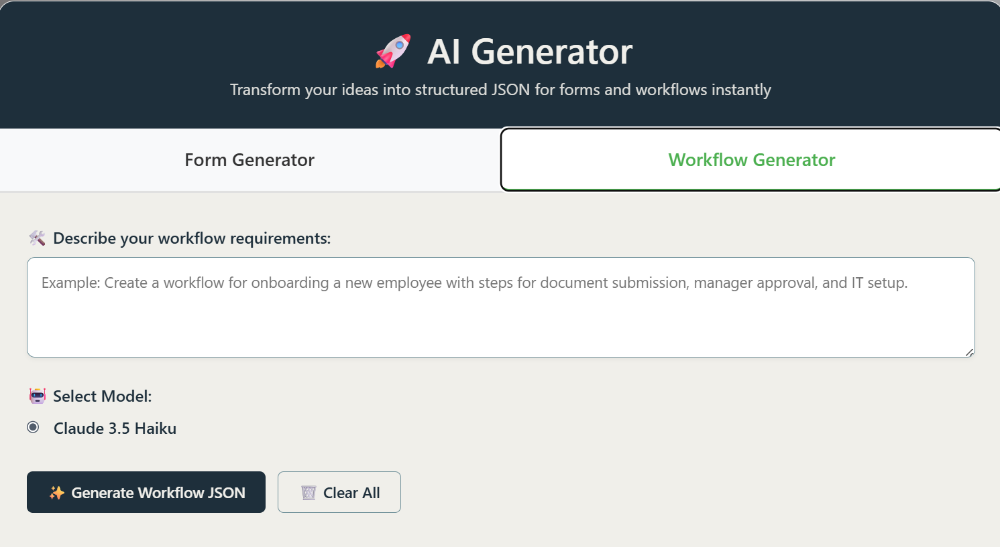
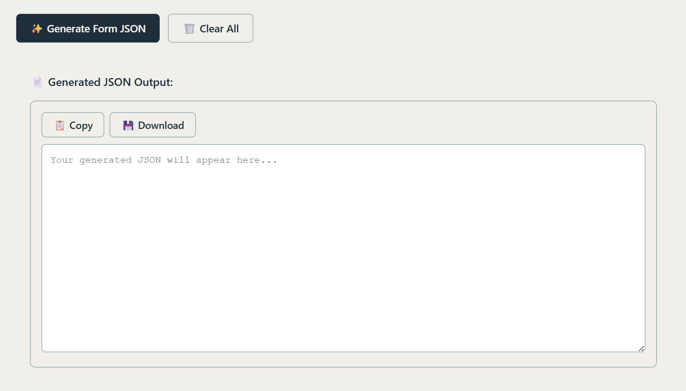

# Screenshots

### 1. Form Generation

_The tab where user can enter prompt to generate forms._

### 2. Workflow Generation

_The tab where user can enter prompt to generate workflows._

### 3. Output Box

_The output box where the generated JSON will appear._
_It contains download button that will downlooad a JSON file with UntanngledPro compatible File name[i.e we can directly upload this JSON file to UntangledPro]._
_The copy button will copy the contents of JSON to clipboard as plain text._

---
